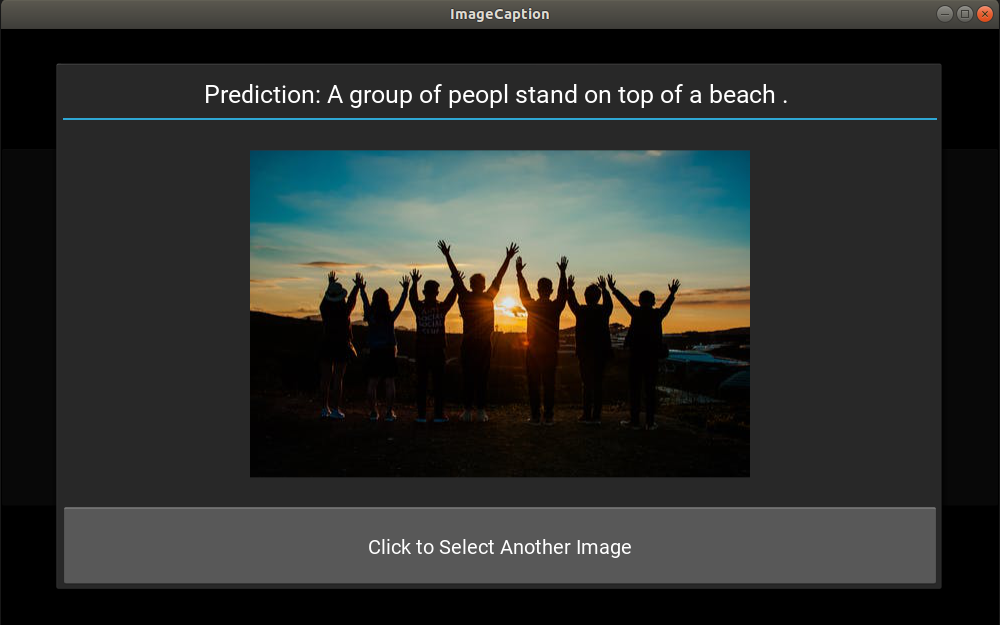

# image_caption_project_DL_50.039
The Image Captioning project for SUTD 50.039 Deep Learning
<br>

*collaborators: Zhao Lutong (1002872), Tang Xiaoyue (1002968), Wang Zijia (1002885)*

# A video demo on our project
https://www.dropbox.com/sh/qfabcdkb6y6ulgq/AABfJeCEvYbmFCTgDyF2Ovgea?dl=0

# Referrence 
Adapted code from:
https://github.com/yunjey/pytorch-tutorial/tree/master/tutorials/03-advanced/image_captioning


# Image Captioning
The goal of image captioning is to convert a given input image into a natural language description. The encoder-decoder framework is widely used for this task. The image encoder is a convolutional neural network (CNN). In this tutorial, we used [resnet-152](https://arxiv.org/abs/1512.03385) model pretrained on the [ILSVRC-2012-CLS](http://www.image-net.org/challenges/LSVRC/2012/) image classification dataset. The decoder is a long short-term memory (GRU)) network. 


#### Training phase
For the encoder part, the pretrained CNN extracts the feature vector from a given input image. The feature vector is linearly transformed to have the same dimension as the input dimension of the GRU network. For the decoder part, source and target texts are predefined. For example, if the image description is **"Giraffes standing next to each other"**, the source sequence is a list containing **['\<start\>', 'Giraffes', 'standing', 'next', 'to', 'each', 'other']** and the target sequence is a list containing **['Giraffes', 'standing', 'next', 'to', 'each', 'other', '\<end\>']**. Using these source and target sequences and the feature vector, the GRU decoder is trained as a language model conditioned on the feature vector.

#### Test phase
In the test phase, the encoder part is almost same as the training phase. The only difference is that batchnorm layer uses moving average and variance instead of mini-batch statistics. This can be easily implemented using [encoder.eval()](https://github.com/yunjey/pytorch-tutorial/blob/master/tutorials/03-advanced/image_captioning/sample.py#L37). For the decoder part, there is a significant difference between the training phase and the test phase. In the test phase, the GRU decoder can't see the image description. To deal with this problem, the GRU decoder feeds back the previosly generated word to the next input. This can be implemented using a for-loop.


## Usage 

#### 1) Using GUI
```bash
conda install kivy -c conda-forge  
python gui.py 
```
*If you counter problem of pygame on Mac system:*
    ```
    pip install pygame
    ``` 

#### 2) Test the model from the terminal

```bash
python sample.py --image='png/example.png'
```


<br>

## Prepare model


### Option 1. Using Pretrained model
If you do not want to train the model from scratch, you can use a pretrained model. You can download the pretrained model [here](https://www.dropbox.com/s/ne0ixz5d58ccbbz/pretrained_model.zip?dl=0) and the vocabulary file [here](https://www.dropbox.com/s/26adb7y9m98uisa/vocap.zip?dl=0). You should extract pretrained_model.zip to `./models/` and vocab.pkl to `./data/` using `unzip` command.

```bash
chmod +x download_pretrained.sh
./download_pretrained.sh
```

<br>

### Option 2.Train from scratch

#### 1. Clone the repositories
The package pycocotools requires cython and a C compiler to install correctly.
If you are using Linux or Mac system:
```bash
cd ../
git clone https://github.com/pdollar/coco.git
cd coco/PythonAPI/
make
python setup.py build
python setup.py install
cd ../../
```

If you are using Windows, you can install pycocotools as follows:

```
pip install git+https://github.com/philferriere/cocoapi.git#egg=pycocotools^&subdirectory=PythonAPI
```


#### 2. Download the dataset

```bash
pip install -r requirements.txt
chmod +x download.sh
./download.sh
```

#### 3. Preprocessing

```bash
python build_vocab.py   
python resize.py
```

#### 4. Train the model

```bash
python train.py    
```

### A Preview for our GUI
